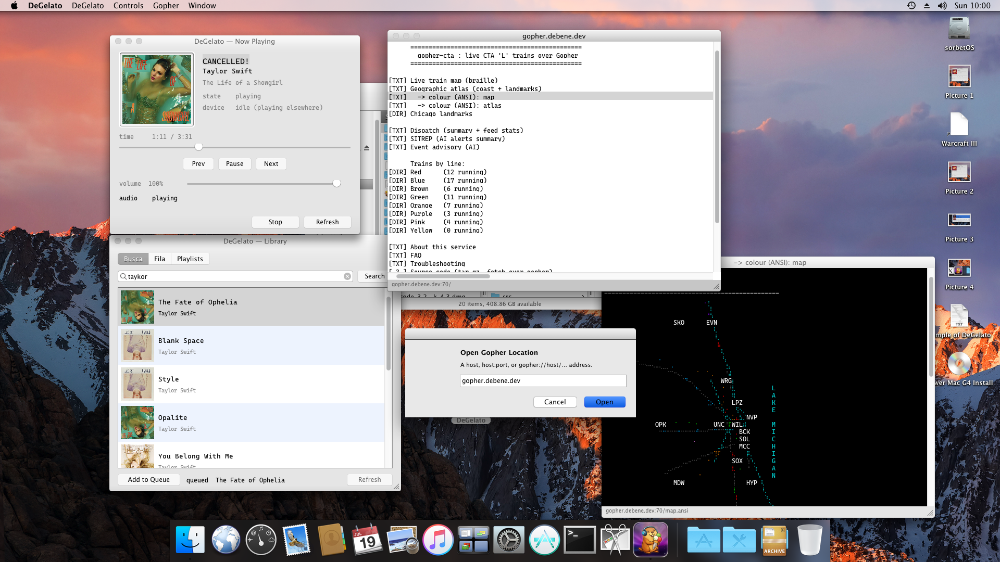

# DeGelato

[](LICENSE)  


> 📸 _Screenshot coming soon — DeGelato on a Power Mac G5 (OS X 10.5 Leopard)._
<!-- When you capture one, replace the line above with:  -->

A native Cocoa Spotify remote — *the essential Radinho* — for **Sorbet Leopard
10.5.x on a Power Mac G5** (ppc, 32-bit). It is the PowerPC sibling of
[DeToca](https://github.com/felipedbene/detoca) (Snow Leopard 10.6.8) — and the
middle rung between it and [Casquinha](https://github.com/felipedbene/casquinha)
(Mac OS 9.2 / classic Toolbox, the oldest machine yet) — speaking the frozen
**[gopher-spot](https://github.com/felipedbene/gopher-spot) machine API
`/spot/api/1`** over raw gopher (RFC 1436), LAN-only. All three follow the same
recipe: [**fhb ▸ CLIENT-PATTERN.md**](https://github.com/felipedbene/fhb/blob/main/CLIENT-PATTERN.md).

**Fio 1** delivered the app skeleton: the gopher socket client, the `/now`
parser, and a text-only now-playing window. **Fio 2** adds audio — live MP3
playback of the gopher-spot Icecast stream via CoreAudio. **Fio 3** adds
transport — play/pause/next/prev, a seek bar, and a volume slider, each a
`/spot/api/1` command that returns a fresh `/now`. **Fio 4** adds album cover
art, fetched from `/cover/<album_id>/<size>` and drawn beside the text.
**Fio 5** adds a search window and an explicit device wake. **Fio 6** adds a
queue window (upcoming tracks) and add-to-queue from search results.

## What it does

Now-playing (fio 1):
- Polls `/spot/api/1/now` every 2 s over a run-loop-scheduled `NSStream`.
- Shows track / artist / album / playback state / position–duration / volume /
  device in **Cascadia Code**, in a single programmatic window (no NIB).
- On a network hiccup it shows `offline — retrying`, keeps the last snapshot on
  screen, and recovers silently when the server answers again.

Audio (fio 2):
- A **Play/Stop** button. On Play it discovers the stream URL from
  `/spot/stream.pls` (a separate MetalLB LoadBalancer IP, Icecast `:8000`),
  parses the PLS, and plays the live 128 kbps MP3 with `DGAudioStreamer`
  (`AudioFileStream` → `AudioQueue`, on a dedicated thread; no GCD/blocks).
- If `/now` reports `device idle` (playback drifted to another device, so the
  audio pipe won't carry it), Play first calls `wake?play=1` to pull playback
  back onto the gopher-spot device, then streams.
- The `audio` line reports `idle → waking… → connecting… → buffering… →
  playing`, or an error.

Transport (fio 3):
- **Prev / Play-Pause / Next** buttons, a **seek** bar, and a **volume** slider —
  each maps to a `/spot/api/1` command (`play`/`pause`/`next`/`prev`/`seek?ms`/
  `volume?0-100`) that returns a fresh `/now`, so one round-trip lands on current
  state. The volume slider drives the API **device** volume (what everyone hears
  on the stream), not the local output gain.
- The seek bar scrubs live and issues `seek?` on mouse-up; a 1 Hz tick advances
  it between the 2 s polls. The play/pause label follows `/now` state.
- Commands settle with ~1–2 s of Spotify eventual consistency; the returned
  snapshot may briefly lag, and the next poll reconciles it.

Search + wake (fio 5):
- **Controls ▸ Search…** (⌘F) opens a separate window: type a query, Enter runs
  `/spot/api/1/search?q=<urlencoded>` (UTF-8, capped at 10 by Spotify), and the
  results table shows track / artist / time. **Double-click** a result to start
  it on the device via the human `/spot/play?uri=<track uri>` selector.
- **Controls ▸ Wake Device** fires a bare `/spot/api/1/wake` (transfer playback
  onto gopher-spot without changing play/pause), adopting the returned `/now`.

Queue (fio 6):
- **Controls ▸ Queue** (⌘U) opens a window listing the upcoming tracks from
  `/spot/api/1/queue` (same `item.<i>.*` list shape as search, so DGTrackItem is
  reused). Refreshed on open and via Refresh.
- **Add to Queue** in the search window enqueues the selected result with
  `/spot/api/1/queue/add?<uri>` (there is no queue/clear in v1 — add only).

### DeToca parity campaign (fios 14–22)

A second campaign brought DeGelato to feature parity with its Snow Leopard
sibling [DeToca](https://github.com/felipedbene/detoca). See
`design/PARITY-audit.md` for the full DeToca × DeGelato matrix.

- **Preferences (⌘,)** — the gopher-spot server address is now a saved
  preference (`DGServerPrefs`), not a hardcoded constant. Host/port with live
  validation, a non-blocking **Test Connection** (round-trip latency), and a
  Save that reconnects the radinho.
- **Cover cache** — a two-level (memory + disk) cover-bytes cache
  (`DGCoverCache`, `~/Library/Caches/…/covers/`) so revisiting an album is free
  and the list can show thumbnails.
- **Library window (⌘F / ⌘U / ⌘Y)** — one segmented window in three modes:
  **Busca** (search → play / add), **Fila** (live up-next, refreshed off the
  poll), **Playlists** (all playlists → **context play**). Rows are 64px
  thumbnail cells.
- **Media keys (⏮ ⏯ ⏭)** — global capture via a Quartz event tap
  (`DGMediaKeyTap`); needs *Universal Access ▸ assistive devices* on 10.5.
- **Gopher browser** — a general RFC 1436 client: **Gopher ▸ Home (⌘⇧H)** and
  **Open Location (⌘L)** open cascaded windows; menus render as a typed-row
  table (double-click to follow), type-0 documents render with full **ANSI
  256-color / truecolor** styling (braille maps aligned via Cascadia Code).
  Type-7 search prompts for a query; **bookmarks** (Add ⌘D / Show) live in a
  hand-editable gophermap under `~/Library/Application Support/DeGelato/`.

## Requirements

- **Build host: the G5 itself.** Sorbet Leopard 10.5.x, Xcode 3.1.4, GCC 4.2.
- Power Mac G5 — **ppc 32-bit only** (`MACOSX_DEPLOYMENT_TARGET = 10.5`, SDK 10.5).
- No ARC, no blocks, no GCD: this is 10.5. Sockets use `NSStream` scheduled on
  `NSRunLoop`; the parser/model are pure Foundation.

## Building

```sh
make            # build DeGelato.app  (ppc, SDK 10.5, -Wall, zero warnings)
make run        # build and launch
make test       # build + run the OCUnit (SenTestingKit) suite, fully offline
make dmg        # package DeGelato-1.0.dmg (app + Applications symlink)
make clean
```

## Install

Open **DeGelato-1.0.dmg** (from `make dmg`) and drag **DeGelato** onto
**Applications**. ppc / Sorbet Leopard 10.5 only; the app is LAN-only and needs
the gopher-spot server reachable at `192.0.2.10:70`.

Defaults live at the top of the `Makefile` (`SDK`, `ARCH=ppc`, `CC=gcc`);
override on the command line if your SDK is elsewhere.

### Clock workaround (Xcode 3 on modern date)

The Xcode 3 code-signing/cert path chokes on today's date, the same disease as
DeToca's 10.6 box. **CLI builds via `make` do not sign anything, so a plain
`make` usually needs no workaround.** If Xcode.app itself or a signing step
complains, set the clock back before launching it and leave NTP off:

```sh
sudo systemsetup -setusingnetworktime off
sudo date 0601000009       # mmddHHMMyy → ~June 2009; adjust to taste
```

Never re-enable NTP from a build script.

## Network contract (v1, frozen)

- Server: `192.0.2.10:70` (LAN only, plain TCP, no TLS).
- Write `selector\r\n`, read to EOF. `/now` returns UTF-8 `key<TAB>value` lines
  (CRLF, bare LF tolerated). See `gopher-spot/API.md` for the exact keys.
- **The client ignores unknown keys and tolerates missing ones** — the API is
  additive; surface growth must never hard-fail the client.
- The server micro-caches `/now` (~1 s); we poll at 2 s and never faster.

Capture a fresh fixture from the live server:

```sh
printf '/spot/api/1/now\r\n' | nc 192.0.2.10 70 > tests/Fixtures/now_live.txt
```

The reusable, platform-agnostic recipe for writing a client like this one lives
in the umbrella repo: **[fhb ▸ CLIENT-PATTERN.md](https://github.com/felipedbene/fhb/blob/main/CLIENT-PATTERN.md)**.
DeGelato is its ppc / 10.5 reference implementation.

## Layout

```
src/
  DGGopherClient.{h,m}            BSD-socket gopher transaction (worker thread)
  DGNowSnapshot.{h,m}            immutable parsed /now snapshot (model)
  DGApiParser.{h,m}             raw text -> fields -> snapshot (pure)
  DGPLSParser.{h,m}             first stream URL from a PLS/M3U (pure)
  DGTrackItem.{h,m}             one item.<i>.* row from a /queue or /search list
  DGAudioStreamer.{h,m}         live Icecast MP3 via AudioFileStream/AudioQueue
  DGFontManager.{h,m}           resolve Cascadia Code (registered via Info.plist)
  DGCoverCache.{h,m}            two-level (memory + disk) cover-bytes cache
  DGServerPrefs.{h,m}           saved gopher-spot host/port (NSUserDefaults)
  DGBookmarkStore.{h,m}         gopher bookmarks in a hand-editable gophermap
  DGANSIParser/DGANSIPalette/DGANSISpan.{h,m}   ANSI 256-color/truecolor styling
  DGMediaKeyTap.{h,m}, DGMediaKeyRouter.{h,m}   global media-key capture (event tap)
  DGNowPlayingWindowController.{h,m}   window + poll + audio + transport controls
  DGLibraryWindowController.{h,m}   segmented Busca / Fila / Playlists window
  DGPreferencesController.{h,m}    Preferences (⌘,) host/port + Test Connection
  DGGopherWindowController.{h,m}   general RFC 1436 gopher browser windows
  AppDelegate.{h,m}, main.m     programmatic app + menu bar (Controls menu)
tests/
  DGApiParserTests.m            parser/model edge cases + on-disk fixtures
  DGGopherClientTests.m         client state machine vs a localhost loopback
  DGPLSParserTests.m            stream-URL extraction (PLS + M3U)
  DGTrackItemTests.m            v1 list parsing (queue/search item.<i>.*)
tests/Fixtures/                 now_live + degenerate /now + stream.pls + cover + search + queue
Resources/
  Fonts/CascadiaCode-Regular.ttf   bundled font (ATSApplicationFontsPath = Fonts)
  DeGelato.icns, OFL.txt
```

## Acceptance (fios 1–3)

- `make` builds ppc with **zero warnings** on the G5.
- `make test` is green (parser + PLS + client state machine).
- Launches on Sorbet 10.5, shows live now-playing within ~3 s; Listen streams
  the live MP3 (audio primes in ~2.5 s); transport commands round-trip and are
  reflected in `/now` (verified live on the G5: volume/pause/play confirmed).

## Not yet

Playlists (the machine API lists them, but `/playlists/<id>` tracks are often
`forbidden` — context play works). No TLS, nothing off-LAN.

---
### Part of the gopher constellation
**Servers & tools:** [gopher-core](https://github.com/felipedbene/gopher-core) · [gopher-cta](https://github.com/felipedbene/gopher-cta) · [gopher-blog](https://github.com/felipedbene/gopher-blog) · [gopher-askthedeck](https://github.com/felipedbene/gopher-askthedeck) · [gopher-spot](https://github.com/felipedbene/gopher-spot) · [the-economist-epub](https://github.com/felipedbene/the-economist-epub)
**Clients:** [casquinha](https://github.com/felipedbene/casquinha) (Mac OS 9) · [detoca](https://github.com/felipedbene/detoca) (OS X 10.6) · [degelato](https://github.com/felipedbene/degelato) (OS X 10.5 PPC) · [deburrow](https://github.com/felipedbene/deburrow) (Android)
**Protocol notes:** [fhb](https://github.com/felipedbene/fhb)
---
